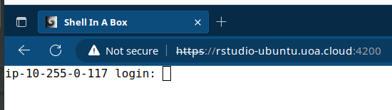
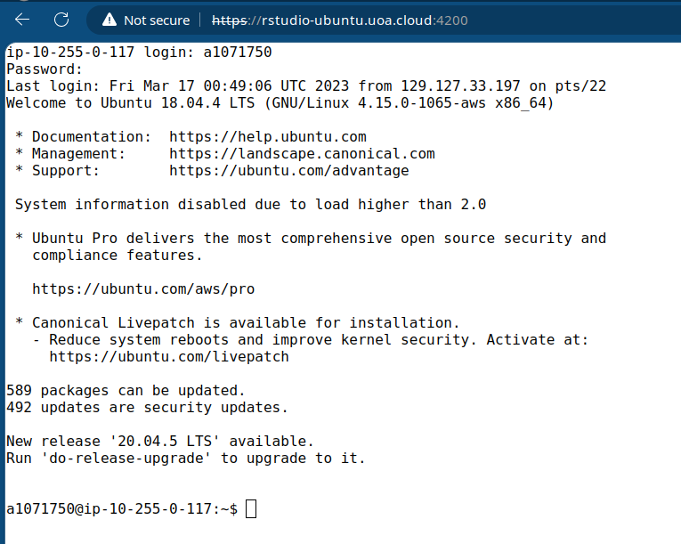
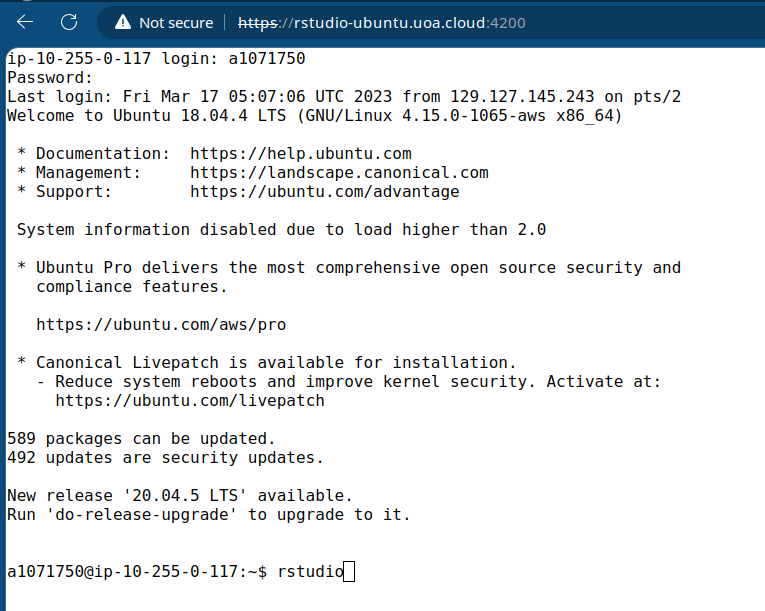
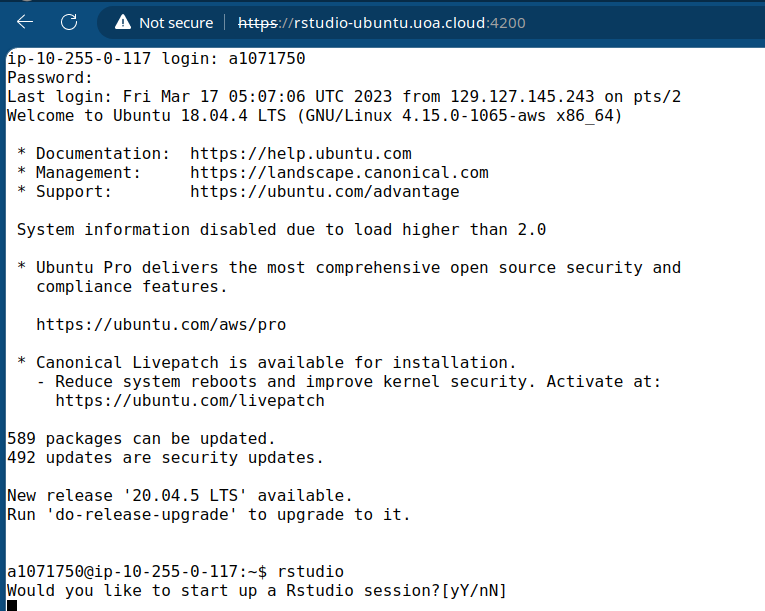
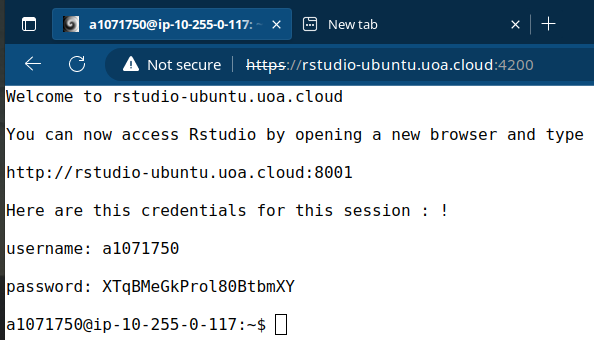

# Connecting to your Cloud Compute Environment

You will have each been given access to cloud compute resources which we access using the IP address below.
All cloud computing accounts are private but are identical and we will use these for the entire practical series. 
Accessing your cloud compute resource is like having your very own server. 

**Follow all instructions here very, very carefully**

1. Open your favourite internet browser. We recommend Firefox, but Edge/Chrome are also acceptable. Safari has not been tested.
2. Enter the following address (`https://rstudio-ubuntu.uoa.cloud:4200`) in the address bar of your browser.
3. You should see this login screen  

    

4. Login with your UoA id number and the password you have been assigned.

    You should see this if login is successful:

    

    **Enter `rstudio` at the prompt (it should look like this)**

    

    
    

    **Type `y` or `Y` at the prompt.**

    **Now you should see the following:** 

    

    Once the Rstudio server has been launched (this may take a couple of minutes) you should see some instructions in the browser: 

    

    __Make sure you copy the password before proceeding__

5. Open a new browser tab as instructed above and type in the URL given above (`http://rstudio-ubuntu.uoa.cloud:8001`)*For this step it is essential that you use `http` and NOT `https`*

    you should see the following login screen. 

    

6. Use your UoA id (a1234567) and paste the password that you copied in the password box. __You have two minutes to complete this__ if you don't complete in time, you have to start over. 

    You now have access to your cloud compute resource (VM). 

    - Every time you log in to your VM you will be given a new one-time password that you have to paste into the Rstudio login panel.
    - RStudio sessions automatically shut down after 3 hours, if this happens and you are still working, log in again, you can resume where you left off. This is because we pay by the minute for access to this resource. Please remember to [log out of RStudio and disconnect](AWS_RONIN_disconnect.md) (see below) when you are done so that we don't pay for compute resources that are not being used. 

    Importantly, because of the one-time password you will be the only person to be able to access your VM as the system has been set up to allow you to use one VM at a time.

You can access your VM:

- When connected from a workstation in Johnson 111
- When connected directly to the University WiFi Network from a personal device
- When connected from another network using the [University of Adelaide VPN](https://www.adelaide.edu.au/technology/your-services/network-services/remote-access-via-virtual-private-network-vpn)

Practice how to [disconnect from your VM](AWS_RONIN_disconnect.md) and then re-connect and go back to the practical instructions. 

[Back](../README.md)