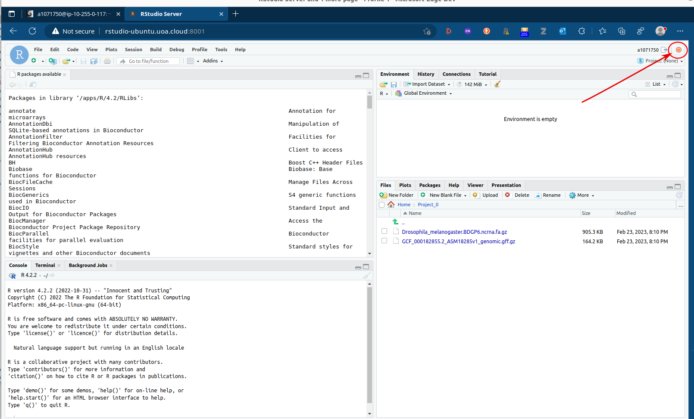
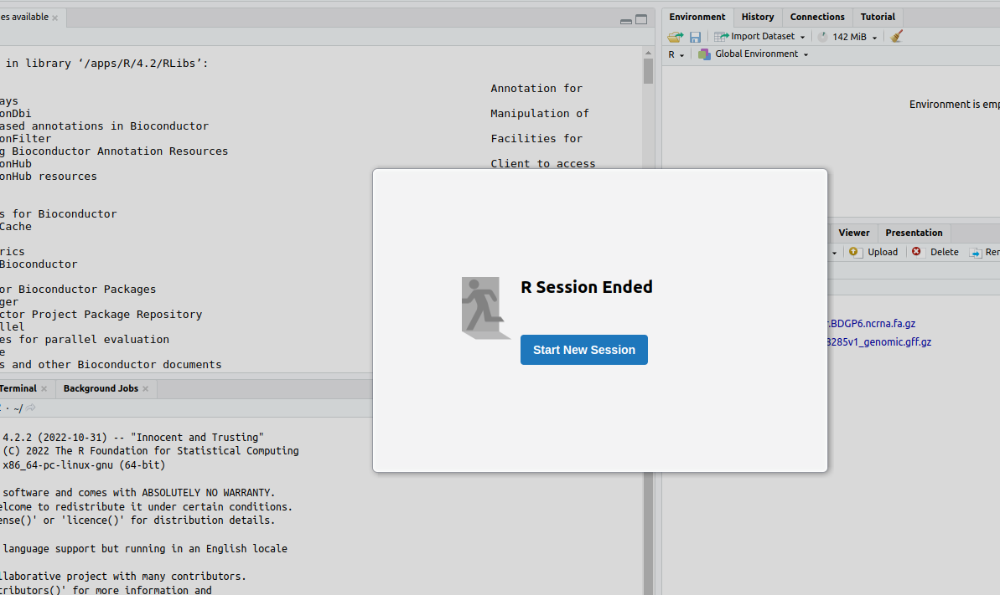
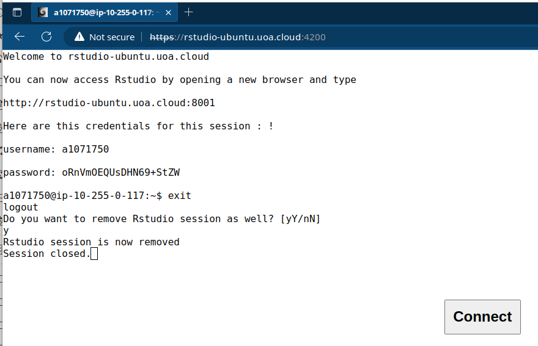

# How to disconnect from your VM

When you are done working on your VM and need to disconnect you first need to logout from RStudio.

1. There is an on/off button at the top of the RStudio window (shown with an arrow pointing at a red circle)

    

2. Push the off button and you should get this:

    

3. You can then close the browser tab for RStudio. **DO NOT close the tab without pushing the off button first!**

    - Once you have closed the RStudio tab, you can logout from the VM in the login tab:

4. type `exit` at the prompt.

5.  You will prompted to remove the Rstudio session
    
    ```
    Do you want to remove Rstudio session as well? [yY/nN]
    ```
    -type `y`.

    You should see this:

    

6. Close the tab or exit the browser and you are done.

If you realise at this point that you forgot to do something and want to log back in, just push the __Connect__ button.

[Back to connection instructions](./AWS_RONIN_connection.md)
