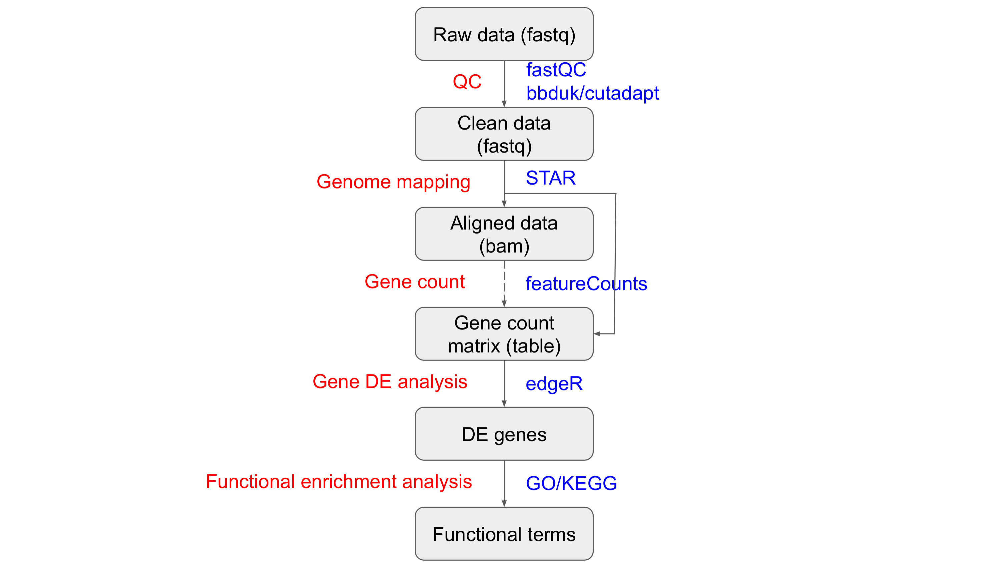

# Week 11 Transcriptomics Practical - DE analysis
*By Zhipeng Qu/Steve Pederson/Jimmy Breen* 

{:.no_toc}

* TOC
{:toc}

## Introduction

Gene differential expression (DE) anaysis using RNA-Seq or transcriptomes is to detect the level of activity at a genomic locus, and determine if any changes are evident due to the specific biological question. 

In this practical, we will be using a RNA-Seq dataset from model plant *Arabidopsis thaliana* to carry out a typical pairwise DE analysis. 

## Dataset

The dataset used in this practical is subsampled from RNA-Seq of two groups of samples from [study of Herbst et al. 2023](https://onlinelibrary.wiley.com/doi/10.1111/tpj.16431). We will be doing a pairwise DE analysis between Arabidopsis seedlings treated with 80 µg/ml Zeocin (treatment group) and mock-treated seddlings (control group), and trying to understand what kinds of genes/pathways might be regulated/perturbed due to Zeocin treatment, which can be used as a radiomimetic drug to understand the molecular mechanisms of DNA damage in plant. Here are some informtions for Arabidopsis and this RNA-Seq dataset:

- Reference genome build: TAIR10 (<https://www.arabidopsis.org/index.jsp>)
- Number of chromosomes: 5 chromosomes + Chloroplast + Mitochondria
- Genome size: ~135 Mb

- Number of samples: 6
- Number of groups: 2, zeocin-treated and mock-treated
- Number of biological replicates per group: 3
- Sequencing type: PE150
- Number of raw reads per sample (subsampled): ~2 million pairs

## Tools and R packages pipeline

The pipeline of this Prac is shown in the following flowchart:



Here are some tools used in this Prac:

| Tools    | Version  | Link                                                                                       |
|----------|----------|--------------------------------------------------------------------------------------------|
| fastqc   | v0.11.9  | https://www.bioinformatics.babraham.ac.uk/projects/fastqc                                  |
| bbduk    | v39.01   | https://jgi.doe.gov/data-and-tools/software-tools/bbtools/bb-tools-user-guide/bbduk-guide/ |
| cutadapt | v3.5     | https://cutadapt.readthedocs.io/en/stable/                                                 |
| STAR     | v2.7.10a | https://github.com/alexdobin/STAR                                                          |

And also, we will mainly use R (4.2.2) to do DE analysis, and there is a list of R packages that we will require:

| Package   | Archive       | LInk                                                               |
|-----------|---------------|--------------------------------------------------------------------|
| tidyverse | CRAN          | https://www.tidyverse.org/                                         |
| limma     | bioconductor  | https://bioconductor.org/packages/release/bioc/html/limma.html     |
| edgeR     | bioconductor  | https://bioconductor.org/packages/release/bioc/html/edgeR.html     |
| reshape2  | CRAN          | https://cran.r-project.org/web/packages/reshape2/index.html        |
| scales    | CRAN          | https://scales.r-lib.org/                                          |
| ggplot2   | CRAN          | https://ggplot2.tidyverse.org/                                     |
| ggsci     | CRAN          | https://cran.r-project.org/web/packages/ggsci/vignettes/ggsci.html |
| Glimma    | biopcpnductor | https://bioconductor.org/packages/release/bioc/html/Glimma.html    |
| pheatmap  | CRAN          | https://cran.r-project.org/web/packages/pheatmap/index.html        |

## Running time estimate (based on teaching VM)

The following table shows the estimated run time in VM for the major steps:

| Step        | Tool/Package| Estimated run time |
| ----------- | ----------- | ----------- |
| QC                            | fastQC      | 5 mins   |
| Sequence trimming             | cutadapt    | 10 mins  |
| Genome mapping for short reads| STAR        | 20 mins  |

## What you will learn in this Practical

- Practice bash commands you have learned
- Practice NGS QC and alignment you have learned
- Learn how to do pairwise DE analysis using RNA-Seq

# Practical 

There are two major steps (5 parts actually) in this Prac.  Please follow the instructions __in order__, because some commands will rely on the results from previous commands. Feel free to talk to tutors/instructors if you have a problem/question. 

## Part 1. Set up and project preparation

Planning your directory structure from the beginning makes your work easier to follow for both yourself and others. 

I put initial input data into a `data` folder, and output files from different processing stages into separate folders in a `results` folder. If there are databases involved, I also create a `DB` folder. I store all scripts in a separate `scripts` folder (we won't use this folder in this Prac). I also use a numbered prefix such as `01_raw_data` to label different folders. All of these naming rules are just personal preference, and feel free to build your own project folder structure rules, and keep it consistent for your different projects in future.

The following is the folder structure for this DE analysis project:

```
./prac_transcriptomics_DE/
├── 01_bin
├── 02_DB
├── 03_raw_data
├── 04_results
│   ├── 01_QC
│   ├── 02_clean_data
│   ├── 03_aligned_data
│   └── 04_DE
└── 05_scripts
```

We can use following commands to build this folder structure:

```bash
cd ~/
mkdir prac_transcriptomics_DE 
cd prac_transcriptomics_DE
mkdir 01_bin 02_DB 03_raw_data 04_results 05_scripts
cd 04_results
mkdir 01_QC 02_clean_data 03_aligned_data 04_DE
```

If you want to check your folder structure:
```bash
cd ~/
tree ./prac_transcriptomics_DE
```

Next we can build soft links of input DB and data files in our corresponding project folders:

```bash
cd ~/prac_transcriptomics_DE/02_DB
ln -s /shared/data/Arabidopsis_TAIR10_genome/TAIR10_chrALL.fa ./
ln -s /shared/data/Arabidopsis_TAIR10_genome/TAIR10_GFF3_genes.gtf ./

cd ~/prac_transcriptomics_DE/03_raw_data
ln -s /shared/data/prac_DE_week11/*.fastq.gz ./
```

Now all the setup work is done. Let's move to part 2.

## Part 2, QC for RNA-Seq

In this part, we will check the sequencing quality of all raw sequencing data first, and then trim adaptor and low-quality sequences from raw sequencing data.

### 2.1 QC for illumina reads

The first step is to do QC for the raw sequencing data using fastQC. You can process all files all in once:

```bash
cd ~/prac_transcriptomics_DE/04_results/01_QC
fastqc -t 2 -o ./ ~/prac_transcriptomics_DE/03_raw_data/*.fastq.gz
```

Or you can write a loop in your bash script to process files one by one.

After we finish the QC, we can check the QC report by opening the `html` file using web browser.

### 2.2 Adaptor and low-quality sequence trimming

After we finish the QC for raw reads, we need to trim adapter and low-quality sequences from the raw reads. The adapters for this RNA-Seq dataset are Illumina TrueSeq adaptors as `AGATCGGAAGAGCACACGTCTGAACTCCAGTCA` and `AGATCGGAAGAGCGTCGTGTAGGGAAAGAGTGT`.

Following is an example commands to trim adaptor and low-quality sequences for one sample (paired reads for this dataset):

```bash
cd ~/prac_transcriptomics_DE/04_results/02_clean_data

# trim adaptor and low-quality sequences using cutadapt for one sample
cutadapt -a AGATCGGAAGAGCACACGTCTGAACTCCAGTCA -A AGATCGGAAGAGCGTCGTGTAGGGAAAGAGTGT -o Col_0_mock_rep1_R1.clean.fastq.gz -p Col_0_mock_rep1_R2.clean.fastq.gz --minimum-length 25 --quality-cutoff 20 ~/prac_transcriptomics_DE/03_raw_data/Col_0_mock_rep1_R1.fastq.gz ~/prac_transcriptomics_DE/03_raw_data/Col_0_mock_rep1_R2.fastq.gz
```

You can run `cutadapt` multiple times to trim all 6 samples, however, the more elegant way would be to write a loop in your bash script to automatically process samples one by one. This is a good practice for you to use the skills that you learned in previous Pracs. 
 
After we trim the adapter and low-quality sequences from the raw data, we have the `clean data` ready for genome mapping.

Before we do the genome mapping, we can run `fastQC` again on these `clean data` to check how we did with the trimming.

## Part 3 Genome mapping/alignment

For a typical differential gene expression analysis using RNA-Seq, we normally have the reference genome available (if you don't have the reference genome, you can do de novo transcriptome assembly first (next Prac), and then do DE analysis based on transcriptome mapping). We will be using a RNA-aligner called `RNA-STAR` to do the genome mapping in this Prac.

Before we do the genome mapping, `STAR` requires the reference genome to be indexed. We can build the `Arabidopsis` reference genome index using following commands:

```bash
cd ~/prac_transcriptomics_DE/02_DB
STAR --runThreadN 2 --runMode genomeGenerate --genomeDir ~/prac_transcriptomics_DE/02_DB/TAIR10_STAR149 --genomeFastaFiles TAIR10_chrALL.fa --sjdbGTFfile TAIR10_GFF3_genes.gtf --sjdbOverhang 124 --genomeSAindexNbases 12
```

After we have the reference genome indexed, we can run align the clean reads aginst the reference genome. The following is an example command to map one sample (You can write a loop in your bash script to process samples automatically).

```bash
cd ~/prac_transcriptomics_DE/04_results/03_aligned_data
STAR --genomeDir ~/prac_transcriptomics_DE/02_DB/TAIR10_STAR149 --readFilesIn ~/prac_transcriptomics_DE/04_results/02_clean_data/Col_0_mock_rep1_R1.clean.fastq.gz \
~/prac_transcriptomics_DE/04_results/02_clean_data/Col_0_mock_rep1_R2.clean.fastq.gz --readFilesCommand zcat \
--runThreadN 2 --outSAMstrandField intronMotif --outSAMattributes All \
--outFilterMismatchNoverLmax 0.03 --alignIntronMax 10000 --outSAMtype BAM SortedByCoordinate \
--outFileNamePrefix Col_0_mock_rep1. --quantMode GeneCounts
```

STAR will output multiple files with prefix `Col_0_mock_rep1`. To get an idea about the mapping info, you can check `Col_0_mock_rep1.final.Log.out`. Another important command option is `--quantMode GeneCounts`. With this option, STAR will count number reads per gene while mapping, and it outputs read counts per gene into a `ReadsPerGene.out.tab` file with 4 columns which correspond to different strandedness options:

- column 1: gene ID

- column 2: counts for unstranded RNA-seq

- column 3: counts for the 1st read strand aligned with RNA (htseq-count option -s yes)

- column 4: counts for the 2nd read strand aligned with RNA (htseq-count option -s reverse)

We will use these `ReadsPerGene.out.tab` files to make a gene count matrix and do DE analysis.

The mapped reads are stored in a `bam` file called `Col_0_mock_rep1.Aligned.sortedByCoord.out.bam`. To view this file in IGV, we need to create an index file (You can write this in the same loop as the genome mapping).

```bash
cd ~/prac_transcriptomics_DE/04_results/03_aligned_data
samtools index Col_0_mock_rep1.Aligned.sortedByCoord.out.bam
```

Basically, up to this step, we have finished all the steps in the first section of DE analysis, which are mainly processed using tools/commands in bash. Next we will move to section 2, in which we will be using different packages under `R` environment.

## Part 4 Gene DE analysis (under R environment)

There are multiple packages to do gene DE analysis, most of them are R-based packages. The DE analysis in this Prac will be mainly based on the `R` package `edgeR`. `edgeR` implements a range of statistical methodology based on the negative binomial distributions, including empirical Bayes estimation, exact tests, generalized linear models and quasi-likelihood tests. If you want to understand more about `edgeR`, have a read of their published [paper](https://www.ncbi.nlm.nih.gov/pmc/articles/PMC2796818/). 

#### R environment

You should already be familiar with `R/Rstudio` environment by now based on what you have learned from your previous Pracs. We have installed all required packages in your VM.

Log into your VM and open the Rstudio.

#### Create an R Project for This Practical

We will do the DE analysis in the folder `~/prac_transcriptomics_DE/03_results/04_DE`.

Let's make an R Project for this folder

1. `File` > `New Project`
2. Select `Existing Directory`
3. Click the `Browse` button
4. Navigate to the `~/prac_transcriptomics_DE/03_results/04_DE` folder and select `Choose`
5. Click `Create Project`


**That's everything done for the setup!!!**

#### Load required R packages

First, we need to load all required R packages into our R workspace.

```{r}
# packages for DE analysis
library(tidyverse)
library(limma)
library(edgeR)

# packages for plot
library(ggplot2)
library(ggrepel)
library(reshape2)
library(scales)
library(ggsci)
library(Glimma)

# clear workspace
rm(list = ls())

# global plot setting
theme_set(theme_bw())
```

#### Get gene annotation information

We normally want to have some additional information about the reference genes so that when we get the differential expressed genes, we can have some ideas about their functions. In this Prac, we can use following R code to get a gene annotation table for all annotated Arabidopsis reference genes.

```{r}
gene_anno_df <- read.delim("https://www.arabidopsis.org/download_files/Genes/TAIR10_genome_release/TAIR10_functional_descriptions")
gene_anno_df$Model_name <- gsub("\\..+", "", gene_anno_df$Model_name)
gene_anno_df <- gene_anno_df[!duplicated(gene_anno_df$Model_name), ]
rownames(gene_anno_df) <- gene_anno_df$Model_name
```

#### Getting the gene count matrix

The input file for our actural DE analysis will be a gene count matrix/table including the number of reads mapped to all reference genes across different groups of samples (Treatment group and control group in our dataset). There are several tools which can be used to get gene counts based on aligned bam files from Part 3. However, when you are using `STAR` to do the genome mapping, you can give parameter `--quantmode gene` to get gene counts simultaneously when you are running `STAR`.

```{r}
# get gene count files for individual samples
star_dir <- file.path("~/prac_transcriptomics_DE/04_results/03_aligned_data")
count_files <- list.files(path = star_dir, pattern = "ReadsPerGene.out.tab$", full.names = T)

# create data matrix with reference genes
firstFile_df <- read.delim(count_files[1], header = F)
firstFile_df <- firstFile_df[-c(1:4), ] 
raw_count_mt <- matrix(0, nrow(firstFile_df), length(count_files))
rownames(raw_count_mt) <- firstFile_df[, 1]
colnames(raw_count_mt) <- rep("temp", length(count_files))

for(i in 1:length(count_files)){
  sample_name <- gsub(".+\\/", "", count_files[i])
  sample_name <- gsub("\\..+", "", sample_name)
  tmp_df <- read.delim(count_files[i], header = F)
  raw_count_mt[,i] <- tmp_df[-c(1:4), 2]
  colnames(raw_count_mt)[i] <- sample_name
}

# get additional gene annotation for genes in count matrix
count_genes <- gene_anno_df[rownames(raw_count_mt),] 
count_genes$gene_name <- rownames(raw_count_mt)
rownames(count_genes) <- count_genes$gene_name

# save raw count table
raw_count_df <- cbind(gene_name = rownames(raw_count_mt), raw_count_mt)
write.csv(raw_count_df, file = "~/prac_transcriptomics_DE/04_results/04_DE/Table1_reference_gene_raw_count.csv", row.names = F)

```

In the above chunk of `R` code, we used a loop to merge gene count for each individual sample (`ReadsPerGene.out.tab` files) into one table (gene count matrix), which is required by `edgeR` for DE analysis.

#### Create `DEGList` objects

The type of object we will use in `R` for DE analysis is known as a `DGEList` and we'll need to set our data up as this object type before being able to do any meaningful analysis.

```{r}
# define counts, samples, groups, and gene annotation info for DEGList object
counts <- raw_count_mt
samples <- colnames(raw_count_mt)
groups <- gsub("_rep.+$", "", colnames(raw_count_mt))
genes <- count_genes

# create DEGList
dgeList<- DGEList(counts = raw_count_mt, 
    samples = samples,
    group = groups, 
    genes = count_genes)
```

Notice in the `$samples` component, there is also a column called `lib.size`.
This is the total number of reads aligned to genes within each sample.

Let's see if we have much difference between samples & groups?

```{r}
dgeList$samples %>%
  rownames_to_column("sample") %>%
  ggplot(aes(x = sample, y = lib.size / 1e6, fill = group)) +
  geom_bar(stat = "identity") +
  ylab("Library size (millions)") + 
  theme(axis.text.x = element_text(angle = 45, hjust = 1))
```

In today's data, we don't have a huge difference, but this can vary greatly in many experiments.
When analysing counts, the number of counts will clearly be affected by the total library size (i.e. the total number of reads counted as aligning to genes).
We before passing this data to any statistical models, we need to calculate a scaling factor that compensates for this.

```{r}
dgeList <- calcNormFactors(dgeList)
```

Notice that now the column `norm.factors`is no longer all `1`.
This is used by all downstream functions in `edgeR`.

#### Data Exploration

One of the things we look for in a dataset, is that the samples from each treatment,group together when we apply dimensional reduction techniques such as Principal Component Analysis (PCA) or Multi Dimensional Scaling (MDS).
The package `edgeR` comes with a convenient function to allow this.

```{r}
cols = pal_npg("nrc", alpha=1)(2)

plotMDS(dgeList, labels = dgeList$samples$type, col = cols[dgeList$samples$group])
```

Here we can see a clear pattern of separation between the groups.

(If we don't see this, it may mean we have some difficult decisions to make.
Maybe we need to check our samples for mislabelling?
Maybe there is some other experimental factor which we're unaware of.)


An interesting way to view our data is to use the value known as `Counts per million`.
This accounts for difference in library sizes and gives an estimate of how abundant each gene is.

```{r}
head(cpm(dgeList))
```

You can see from this first 6 genes, that we have one highly abundant gene, and a couple with far lower expression levels.

#### Filtering out genes

Genes with low count numbers give us minimal statistical power to detect an changes in expression level, so a common approach is to filter out these genes.
This reduces the issues which we will face due to multiple hypothesis testing, effectively increasing the statistical power of a study.

A common method would be to remove any genes which are below a specific CPM threshold in the majority of samples.
In this dataset, we might like to remove genes which have $<1$ CPM in 4 or more samples.

Any number of strategies can be applied for this stage.

We can plot the densities of each of our samples using log-transformed CPM values, and the clear peak in the range of very low expression is clearly visible.

```{r}
plotDensities(cpm(dgeList, log = TRUE), main = "all genes", legend = "topright")
```

Let's filter our dataset, and remove genes with low abundances.

```{r}
genes2keep <- rowSums(cpm(dgeList) > 1) > 3
```

Here we've created a logical vector defining which genes to keep.
To get a quick summary of this enter

```{r}
summary(genes2keep)
```

Now let's look at the densities after filtering.

```{r}
plotDensities(cpm(dgeList, log = TRUE)[genes2keep, ], main = "fitered genes", legend = "topright")
```

Now we're happy that we have the genes we can extract meaningful results from, let's remove them from our dataset.

```{r}
dgeList <- dgeList[genes2keep, ]
```

#### Calculating moderated dispersions

Most RNA-Seq analysis is performed using the *Negative Binomial Distribution*.
This is similar to a *Poisson* distribution, where we **count** the number of times something appears in a given interval.
The difference with a Negative Binomial approach is that we can model data which is more variable.
Under the Poisson assumptions, the variance equals the mean, whilst under the *NB* this is no longer required.

This extra variability is known as the *dispersion*, and our estimates of dispersion will be too high for some genes, and too low for others.
Taking advantage of the large numbers of genes in an experiment, we can shrink the ones that are too high, and increase the ones that are too small.
This is an important step in RNA Seq analysis, as it reduces the number of false positives, and increase the numbers of true positives.

Before we do this, we need to define our statistical model.
Here, our term of interest is in the column `group`.

```{r}
design <- model.matrix(~0 + group, data = dgeList$samples)
design
```


```{r}
dgeList <- estimateDisp(dgeList, design = design)
```

#### Performing differential expression analysis

The most common analytic approach we use is an Exact Test, proposed by Robinson and Smyth.
This is analogous to Fisher's Exact Test, as once again we are dealing with count data, not Normally distributed data.

In the following line of code, we are comparing the first two groups in our data.
Clearly we only have two groups in this dataset,but it is quite common to have multiple groups in other analyses.

```{r}
etResults <- exactTest(dgeList, pair = 1:2)$table 
```

As we've discovered, we need to account for our multiple testing considerations.
Under the null hypothesis, we would expect the distribution of $p$-values to be approximately uniform on the interval [0, 1]
.
However, under the the alternative hypothesis, we should see a spike of $p$-values near zero.
A "healthy" dataset will likely have a mixture of the two distributions, so we should see a flat distribution, with a cluster of values near zero.

```{r}
hist(etResults[,"PValue"], breaks= 50)
```

This gives us confidence that we will be able to detect DE genes in this dataset.
Now, we can proceed to estimate the False Discovery Rate in this data.

```{r}
etResults <- etResults %>%
  rownames_to_column("Geneid") %>%
  mutate(FDR = p.adjust(PValue)) %>%
  arrange(PValue) %>%
  as_tibble()
```

Find the highest ranked gene in this dataset
If it's been given a negative value for logFC, this means it's down-regulated in the second of the two conditions.
The opposite is true for a positive value for logFC.
Let's check the raw counts using *counts per million*

```{r}
cpm(dgeList, log= TRUE)["AT5G48720",]
```

Inspect a few more of the highly ranked genes, so make sure you can understand these results.

Let's get a list of significant genes, by using an FDR of 0.01, and logFC $>1$.
(logFC is fold-change on the $\log_2$ scale, so that logFC=1, is a two-fold increase, logFC=2 is a 4-fold increase,and logFC=-1 is a halving of expression)

```{r}
sigGenes <- filter(etResults, FDR< 0.01, abs(logFC) > 1)$Geneid
```

We can save the statistically significant DE genes into a table for future downstream analysis

```{r}
write.csv(etResults[etResults$Geneid %in% sigGenes, ], 
            file = "~/prac_transcriptomics_DE/04_results/04_DE/Table2_sigGenes.csv", 
            row.names = F)
```

Now we can visualise the pattern of logFC to expression level.

```{r}
plotMD(dgeList, status = rownames(dgeList) %in% sigGenes)
```

An alternative is to plot the logFC in relation to the $p$-value, to make what is known as a volcano plot.

```{r}
etResults %>%
  mutate(DE = Geneid %in% sigGenes) %>%
  ggplot(aes(x = logFC, y = -log10(PValue),colour = DE)) +
  geom_point() +
  scale_colour_manual(values = c("grey50", "red"))
```

We can also generate interactive HTML graphics to examine the expression difference of individual genes between groups using R package `Glimma`.

```{r}
DEs -> decideTests(exactTest(dgeList), adjust.method = "fdr", p.value = 0.01, lfc = 1)
md_name -> "prac_transcriptomics_DE/04_results/04_DE/glimmer_plot"
glMDPlot(exactTest(dgeList), counts = cpm(dgeList, log = TRUE),
        groups = dgeList$samples$group,
        status = DEs[, 1],
        main="MD plot: Col_0_normal_light_vs_Col_0_mock",
        side.main = "ID", side.ylab = "Expression (CPM)",
        sample.cols = pal_npg()(2)[dgeList$samples$group],
        folder = md_name, launch = FALSE)
```

`edgeR` offers many more other variants on DE analytic appraches other than `Exact Test`. As the description in its user guide, *"The glm approach is more popular than the classic approach as it offers great flexibilities. There are two testing methods under the glm framework: likelihood ratio tests and quasi-likelihood F-tests. The quasi-likelihood method is highly recommended for differential expression analyses of bulk RNA-seq data as it gives stricter error rate control by accounting for the uncertainty in dispersion estimation. The likelihood ratio test can be useful in some special cases such as single cell RNA-seq and datasets with no replicates."* Due to time limitation, we wound cover these other approaches in this Prac. Please have a look at the `edgeR` [user guide](https://bioconductor.org/packages/release/bioc/vignettes/edgeR/inst/doc/edgeRUsersGuide.pdf) if you want to learn more about these different approaches.

## Part 5 Additional analysis

After we get a list of differentially expressed genes between groups (e.g. treatment group vs control group in our dataset), we can do all different kinds downstream analyses based on this DE gene list. One common downstream analysis is the functional enrichment/over-representation analysis.

There are many tools/packages which can be used to do functional enrichment analysis for DE genes. One popular and easy-to use tool is the web-based DAVID (Database for Annotation, Visualization and Integrated Discovery). I'll briefly show you how to do the GO/KEGG functional enrichment analysis for the DE gene list that we obtained in this Prac.
