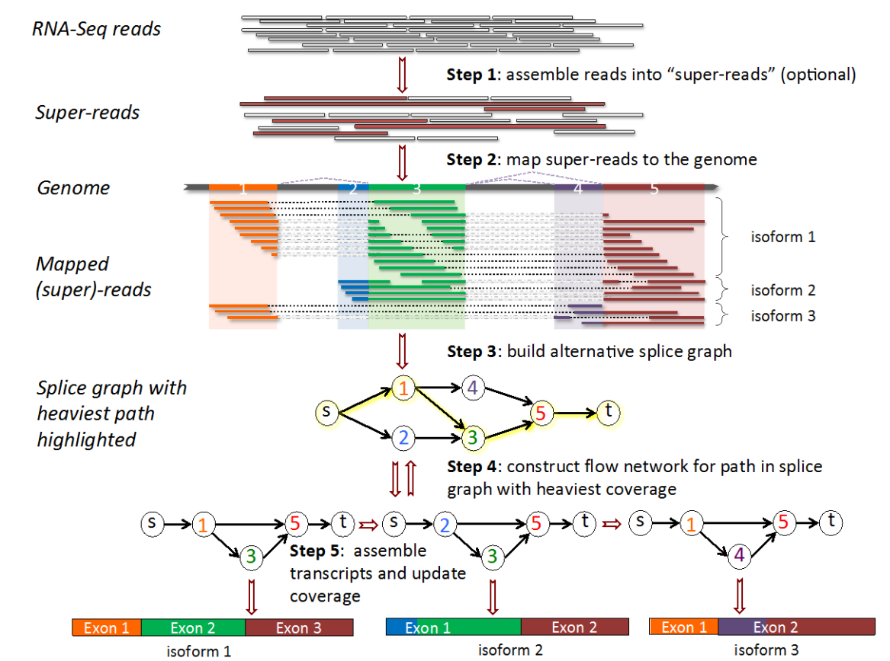
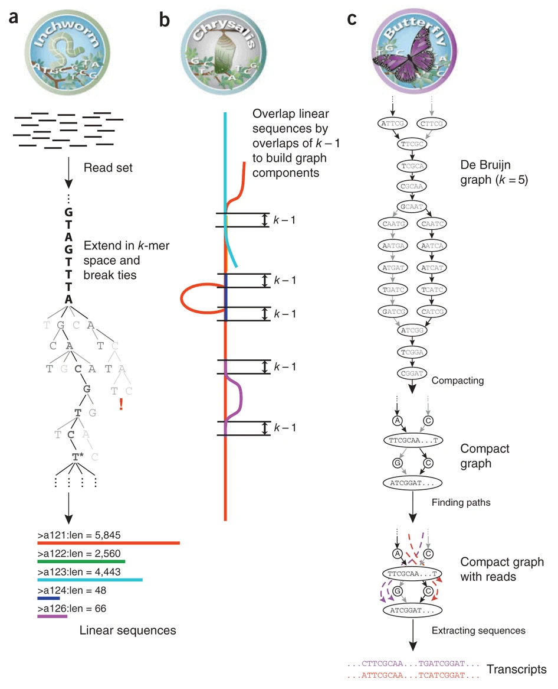
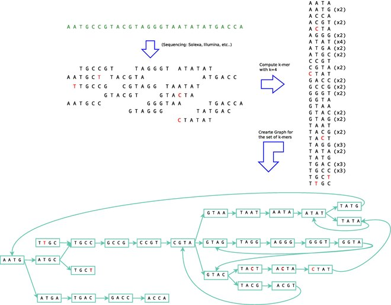

# Week 12 Transcriptomics Practical - assembly
*By Zhipeng Qu* 

{:.no_toc}

* TOC
{:toc}

## Introduction

In this practical, we will use a RNA-Seq dataset from a model plant *Arabidopsis thaliana* (Wang et al, 2017, <https://onlinelibrary.wiley.com/doi/10.1111/tpj.13481>). 
This dataset was initially used for identification of long non-coding RNAs by transcriptome assembly of RNA-Seq.

Our aim will be to assemble transcripts using genomic alignments followed by StringTie.
Following that, we will perform a *de novo* assembly using Trinity, which is a far more computationally demanding approach. 
(Please note the expected run time below)
If we get time, we can compare the assemblies using some QC metrics.

We will not be using `R` for any of today's material, but the material has been tested using the Terminal inside RStudio so please use the Terminal inside the RStudio IDE.

### StringTie

The first step will be to identify novel transcripts using `stringtie` (Pertea et al, 2015, <https://www.nature.com/articles/nbt.3122>).
We'll first trim and check QC for the underlying data, then we'll move onto the assembly itself.

As shown briefly in the lecture notes, the full StringTie process would be to assemble 
"super-reads" before aligning to the genome, however, we will simply use the reads provided, 
given how small this dataset is.



After we have aligned our reads to the reference genome, Stringtie will build the "alternative splice graph", then proceed on to constructing the "flow network".
Finally, it will identify the most likely transcripts using a network flow algorithm.
Note that this algorithm focusses on the most commonly seen splicing patterns, and uses these to guide the assembly.

### Trinity

After completing our StringTie assembly, we'll attempt a full *de novo* assembly using Trinity (Haas et al, 2013, <https://www.nature.com/articles/nprot.2013.084>).
This assembles the transcriptome directly from the reads, without aligning to a reference genome.
The full Trinity repository with detailed help pages and guides is also accessible [here](https://github.com/trinityrnaseq/trinityrnaseq/wiki)

Given that this process will run for 2-3 hours, the explanation regarding the underlying methology is below, for you to read while the process is underway.


## Dataset

Due to the the limitation of computing resources in our VM, we will use a subset of raw reads (reads from chromomose 2 of Arabidopsis) 
from one of three biological replicates sampled from leaf tissue. 
Here is the key information about the Arabidopsis genome and this RNA-Seq datatset:

### The Arabidposis Genome

- Reference genome build: TAIR10 (<https://www.arabidopsis.org/index.jsp>)
- Number of chromosomes: 5 chromosomes + Chloroplast + Mitochondria
- Genome size: ~135 Mb

### The RNA-Seq dataset

- Number of raw reads (pairs): 550,405
- Sequencing type: PE125 (2x125nt)

## Tools and pipeline

The pipeline of today's Prac is shown in the following flowchart:


Tools used in this Prac:

| Tool/Package| Version     | URL |
| ----------- | ----------- | ----------- |
| fastQC      | v0.11.9     |   <https://www.bioinformatics.babraham.ac.uk/projects/fastqc/>   |
| cutadapt    | 3.5         |   <https://cutadapt.readthedocs.io/en/stable/>   |
| Trinity     | 2.15.1      |   <https://github.com/trinityrnaseq/trinityrnaseq/wiki>   |
| GMAP        | 2021-12-17  |   <http://research-pub.gene.com/gmap/>   |
| STAR        | 2.7.10a     |   <https://github.com/alexdobin/STAR>   |
| StringTie   | v2.2.1      |   <https://ccb.jhu.edu/software/stringtie/>   |
| BUSCO       | 5.4.4       |   <https://busco.ezlab.org/>   |
| gffread     | 0.12.7      |   <http://cole-trapnell-lab.github.io/cufflinks/> |
| IGV         | web         |   <https://software.broadinstitute.org/software/igv/> |

## Running time estimate (based on teaching VM)

The following table shows the estimated run time in VM for the major steps:

| Step        | Tool/Package| Estimated run time |
| ----------- | ----------- | ----------- |
| QC                            | fastQC      | 3 mins  |
| Sequence trimming             | cutadapt    | 4 mins  |
| De novo assembly              | Trinity     | 2.5 hrs |
| Genome mapping for transcripts| GMAP        | 3 mins  |
| Genome mapping for short reads| STAR        | 10 mins |
| Genome-guided assembly        | StringTie   | 1 mins  |
| BUSCO for Trinity             | BUSCO       | 3 mins  |
| BUSCO for StringTie           | BUSCO       | 3 mins  |
| Viewing assembly in IGV       | IGV         | N/A     |

## What you will learn in this Practical

- Learn how to build and create scripts for an analysis
- Practice bash commands you have learned
- Practice QC for NGS data you have learned
- Learn how to do genome-guided transcriptome assembly
- Learn how to do de novo transcriptome assembly

# Practicals for transcriptome assembly

There are three parts to the transcriptome assembly in this Prac. 
Please follow the instructions __in order__, because later commands will rely on the results from previous commands. 
Feel free to talk to tutors/instructors if you have a problem/question.
We're here to help & love to talk about these types of analysis.

## Part 1, Setup and data preparation

In this part, we will create some folders to keep files (including input RNA-Seq raw reads, databases and output files) organised.

### 1.1 Prepare folder structure for the project

For each project, I normally store files at different processing stages in different folders. 
I put initial input data into a `data` folder, and output files from different processing stages into separate folders in a `results` folder. 
If there are databases involved, I also create a `DB` folder. 
I store all scripts in a separate `scripts` folder.

Let's use a slightly different directory structure to last time.

``` bash
## First we'll make the directory for the entire practical session
## Notice that we're using the absolute path here, given that '~' stands for 
## your 'home' directory (/home/rstudio for all of us)
mkdir ~/prac_transcriptomics_assembly
```

Now that we've made a directory for today, let's configure the rest of the structure.
Instead of numbering directories, we can use a series of sensible names

``` bash
## Change into to practical directory we have just created
cd ~/prac_transcriptomics_assembly
## Now it's easier to make a series of lower-level directories
mkdir data
mkdir logs
mkdir output
mkdir reference
mkdir scripts
```

Now let's make some subdirectories for key steps during our analysis


``` bash
## We can place our FastQ files in subdirectories in data
mkdir data/raw
mkdir data/trimmed
mkdir data/aligned
```

The FastQC reports can go in our output directory

``` bash
## Using the -p flag allows the parent directories to be created
mkdir -p output/fastqc/raw
mkdir -p output/fastqc/trimmed
```

Next we'll make some directories for the assemblies

``` bash
mkdir output/stringtie
mkdir output/assembly
```

Finally, we'll create a directory to place any logfiles

``` bash
mkdir output/logs
```


The final folder structure for this project will look like this:

```
prac_transcriptomics_assembly/
├── data
│   ├── aligned
│   ├── raw
│   └── trimmed
├── logs
├── output
│   ├── assembly
│   ├── fastqc
│   │   ├── raw
│   │   └── trimmed
│   └── stringtie
├── reference
└── scripts
```

We can see this structure by typing the command `tree` from our current directory

### 1.2 Raw data and DB

The initial RNA-Seq raw data is stored in the shared data directory `~/data/prac_assembly_week12`.

Copy the raw data to your `data/raw` folder

```bash
cp ~/data/prac_assembly_week12/*.fastq.gz ./data/raw/
```

The databases, including Arabidopsis reference genome (TAIR10_chrALL.fa), 
annotated genes (TAIR10_GFF3_genes.gtf), 
and BUSCO lineages file (viridiplantae_odb10.2020-09-10.tar.gz) need to be copied 
from `~/data/prac_assembly_week12` and the tarball decompressed and extracted (i.e. untarred)

```bash
## Copy the reference genome. Both files will begin with TAIR10_ so can just use
## the wildcard (*) to copy them across in one easy command
cp ~/data/prac_assembly_week12/TAIR10_* ./reference/

## Now copy our databset of conserved orthologs
cp ~/data/prac_assembly_week12/viridiplantae_odb10.2020-09-10.tar.gz ./reference/

## This is the type of file known as a 'tarball', which contains a complete
## directory structure in a compressed form. We use the command 'tar' to create 
## or extract these structures. The flags '-xzvf' let tar know that the tarball
## is to be extracted (x), is compressed (z), that we want to see the files being
## extracted (i.e. verbose: v), and that the file is a tarball (f)
tar -zxvf ~/prac_transcriptomics_assembly/reference/viridiplantae_odb10.2020-09-10.tar.gz --directory ./reference
```

Now, all the setup work is done. Let's move to part 2.
From here, we'll start to record all of our commands as `bash` scripts too.

## Part 2, QC

In This part, we will use the skills that we learned from the `NGS_practicals` to do QC and trim adapters and low-quality sequences from our RNA-Seq raw data.
This is also quite similar to the previous Differential Expression practical

### 2.1 QC for raw reads

The first step is to do QC for the raw reads using fastQC.
Whilst we could do this in the terminal like we did previously, let's start building a script

``` bash
touch scripts/pre_processing.sh
```

Now open this file in either `nano` or the RStudio editor and add the shebang in the first line.

``` bash
#! /bin/bash
```

Now add a blank line or two, then enter the following in the script to define our directories.
This defines our key directories to use in subsequent commands

``` bash
ROOTDIR=~/prac_transcriptomics_assembly
DATADIR="${ROOTDIR}/data"
FQCDIR="${ROOTDIR}/output/fastqc"
LOGDIR="${ROOTDIR}/output/logs"
PREFIX="Col_leaf_chr2"
```

Now add a couple more blank lines, then the commands to run FastQC.
We won't run this just yet, but will run the entire script in a minute

``` bash
## Run FastQC on the raw data
echo "Running FastQC on raw data"
fastqc -t 2 -o ${FQCDIR}/raw ${DATADIR}/raw/*.fastq.gz
```

### 2.2 Adaptor and low-quality sequence trimming


The next step in the script will be to run `cutadapt`, just like in the DE Genes practical
The adapters for this RNA-Seq dataset are Illumina TrueSeq adapters as `AGATCGGAAGAGCACACGTCTGAACTCCAGTCA` and `AGATCGGAAGAGCGTCGTGTAGGGAAAGAGTGT`.


``` bash
echo "Running cutadapt"
cutadapt \
  -a AGATCGGAAGAGCACACGTCTGAACTCCAGTCA -A AGATCGGAAGAGCGTCGTGTAGGGAAAGAGTGT \
  -o ${DATADIR}/trimmed/${PREFIX}_R1.fastq.gz \
  -p ${DATADIR}/trimmed/${PREFIX}_R2.fastq.gz \
  --minimum-length 25 \
  --quality-cutoff 20 \
  ${DATADIR}/raw/${PREFIX}_R1.fastq.gz ${DATADIR}/raw/${PREFIX}_R2.fastq.gz > ${LOGDIR}/${PREFIX}_cutadapt.log
```

Now we've trimmed the reads, we should run FastQC again

``` bash
echo "Running FastQC on trimmed data"
fastqc -t 2 -o ${FQCDIR}/trimmed/ ${DATADIR}/trimmed/*.fastq.gz
```

### 2.3 Run the Pre-Processinf Script

Now save this script and try running it

``` bash
bash scripts/scripts/pre_processing.sh
```

This should run in only a few minutes.
Once complete, check the raw FastQC reports, then the trimmed FastQC reports.
Given we only have ~500,000 reads in this dataset some of the plots

### Key Questions

1. How many reads were discarded when trimming R1 and R2
2. What did the command ` > ${LOGDIR}/${PREFIX}_cutadapt.log` do?
3. Inspect the output file from the previous command

These kind of log files capture the output tools like `cutadapt` write to the screen and can be valuable for downstream QC, 
especially if processing multiple files of variable quality.


## Part 3, Genome guided transcriptome assembly (Only applicable if there is a reference genome)

In this section, we will do genome guided transcriptome assembly using STAR and StringTie.

### 3.1 Genome mapping using STAR

The first step for genome guided transcriptome assembly is to map RNA-Seq reads to a reference genome. We will use STAR to do this job in this practical (You can also choose other short RNA aligners to do the mapping).

For genome mapping using STAR, we first need to build the genome index.
This index is exactly like the index at the back of a book, but instead of keywords and page numbers, it has sequences and genome co-ordinates.

Again, we'll write this as a script for future reference

``` bash
touch scripts/build_star_index.sh
```

Then open the file in `nano` or the RStudio editor and add the *shebang* on the first line (`#! /bin/bash`)

Then add a couple of blank lines, followed by the commands to build the STAR index.
We'll also define the paths in this script so it can be run from anywhere on the VM

```bash
ROOTDIR=~/prac_transcriptomics_assembly
REFDIR=${ROOTDIR}/reference
STAR \
  --runThreadN 2 \
  --runMode genomeGenerate \
  --genomeDir ${REFDIR}/TAIR10_STAR125 \
  --genomeFastaFiles ${REFDIR}/TAIR10_chrALL.fa \
  --sjdbGTFfile ${REFDIR}/TAIR10_GFF3_genes.gtf \
  --sjdbOverhang 124 \
  --genomeSAindexNbases 12
```

Now save the script and run it

``` bash
bash scripts/build_star_index.sh
```

The next step will be to align our reads to the reference genome.
Once again, we'll write a script for this

``` bash
touch scripts/star_alignments.sh
```

Then open the file in `nano` or the RStudio editor and add the *shebang* on the first line (`#! /bin/bash`)

Now add a couple of blank lines, followed by our key directories

``` bash
ROOTDIR=~/prac_transcriptomics_assembly
REFDIR=${ROOTDIR}/reference
FQDIR=${ROOTDIR}/data/trimmed
BAMDIR=${ROOTDIR}/data/aligned
PREFIX="Col_leaf_chr2"
```

Add another blank line or two, followed by the commands to align our reads

``` bash
echo "Aligning to the reference"
STAR \
  --genomeDir ${REFDIR}/TAIR10_STAR125 \
  --readFilesIn ${FQDIR}/${PREFIX}_R1.fastq.gz ${FQDIR}/${PREFIX}_R2.fastq.gz \
  --readFilesCommand zcat \
  --runThreadN 2 \
  --outSAMstrandField intronMotif \
  --outSAMattributes All \
  --outFilterMismatchNoverLmax 0.03 \
  --alignIntronMax 10000 \
  --outSAMtype BAM SortedByCoordinate \
  --outFileNamePrefix ${BAMDIR}/${PREFIX}. 
```

After aligning, we (almost) always need to index the bam file

``` bash
echo "Indexing the bam file"
samtools index -@2 ${BAMDIR}/${PREFIX}.Aligned.sortedByCoord.out.bam
```

Save this script then run using.


``` bash
bash scripts/star_alignments.sh
```

#### Key Questions

The command we used to align the reads had quite a few parameters (or arguments).
See if you can understand what the following arguments told `STAR` to do

1. `--runThreadN 2`
2. `--readFilesCommand zcat`
3. `--outSAMtype BAM SortedByCoordinate`


### 3.2 Assembly using StringTie

Now we have our alignments, sorted by genomic co-ordinate, we can use StringTie to assemble the alignments into transcripts.
First, we'll call `stringtie` which will provide a gtf with all gene, transcript and exon co-ordinates.
However, this is only part of the story and the next step will be to extract the transcript sequences themselves.

Once again, let's write a script for this

``` bash
touch scripts/stringtie_assembly.sh
```

Then open the file in `nano` or the RStudio editor and add the *shebang* on the first line (`#! /bin/bash`).
Follow this with a blank line or two, then we can define our directories and variables.

``` bash
ROOTDIR=~/prac_transcriptomics_assembly
REFDIR=${ROOTDIR}/reference
BAMDIR=${ROOTDIR}/data/aligned
OUTDIR=${ROOTDIR}/output/stringtie
PREFIX="Col_leaf_chr2"

echo "Running StringTie on ${PREFIX}"
stringtie \
  ${BAMDIR}/${PREFIX}.Aligned.sortedByCoord.out.bam \
  -o ${OUTDIR}/${PREFIX}_stringtie.gtf \
  -p 2
```

To finish the script, we'll call `gffread` which will extract the transcript sequences from the reference genome

``` bash
gffread \
  -w ${OUTDIR}/${PREFIX}_stringtie.fa \
  -g ${REFDIR}/TAIR10_chrALL.fa \
  ${OUTDIR}/${PREFIX}_stringtie.gtf
```

Now save the script and run it

``` bash
bash scripts/stringtie_assembly.sh
```

Let's quickly compare our reference gene annotations with the transcripts identified using StringTie

``` bash
head output/stringtie/Col_leaf_chr2_stringtie.gtf 
sed -n 241,260p reference/TAIR10_GFF3_genes.gtf | egrep 'CDS'
```

*Can you see anything in the official annotations which resembles that first transcript identified using StringTie?*


### 3.3 Assessing the assembly quality using BUSCO

After we get the assembled transcripts, we need to find some ways to assess the quality of the assembly, such as the completeness of genes/transcripts. 
One way that we can check the assembly quality is by using BUSCO (Benchmarking Universal Single-Copy Orthologs, <https://busco.ezlab.org/>). 
BUSCO provides quantitative measures for the assessment of genome assembly, gene set, 
and transcriptome completeness, based on evolutionary-informed expectation of gene content from *near-universal single-copy orthologs* selected from different lineages.


BUSCO was installed under a different conda environment in VM, so to make life a little easier, 
let's first run this interactively in the terminal.
We sometimes use `conda` environments to install software with specific dependencies in an isolated 
environment so they don't interfere with similar dependencies for other software.

To enable access to BUSCO, we need to activate the conda environment with the correct dependencies,
and where we have `busco` installed.

```bash
source activate busco
```

You should be able to see that your terminal prompt is now showing `(busco) axxxxxxx@ip-xx-xxx-x-xx:/shared/axxxxxxx$` after the `busco` environment is activated.

We'll need to include this in our script for running busco

```
touch scripts/stringtie_busco.sh
```

Now paste the following into the script using your preferred editor

```bash
#! /bin/bash

ROOTDIR=~/prac_transcriptomics_assembly
REFDIR=${ROOTDIR}/reference
OUTDIR=${ROOTDIR}/output
PREFIX="Col_leaf_chr2"

echo "Activating busco conda env"
source activate busco

busco \
  -i ${OUTDIR}/stringtie/${PREFIX}_stringtie.fa \
  -l ${REFDIR}/viridiplantae_odb10 \
  --out_path ${OUTDIR}/busco \
  -o ${PREFIX}_stringtie \
  -m transcriptome \
  --cpu 2
```

Run the script using `bash scripts/stringtie_busco.sh`

BUSCO will output a collection of files including the information for predicted ORFs (Open Reading Frames) from assembled transcripts and output files from a `blast` search against orthologs. 
Of these output files, the most important one is the text file called `short_summary_BUSCO_StringTie_viridiplantae.txt`. 
This should be in the directory `output/busco/Col_leaf_chr2_stringtie/`, which `busco` created when running with our parameters.

In it you will find one summary line that looks like this `C:20.2%[S:14.8%,D:5.4%],F:5.2%,M:74.6%,n:425`. 
This line summarises the completeness of assembled transcripts, and explanations of these numbers can be found in the same text file after the one line summary.

```
	***** Results: *****

	C:20.2%[S:14.8%,D:5.4%],F:5.2%,M:74.6%,n:425	   
	86	Complete BUSCOs (C)			   
	63	Complete and single-copy BUSCOs (S)	   
	23	Complete and duplicated BUSCOs (D)	   
	22	Fragmented BUSCOs (F)			   
	317	Missing BUSCOs (M)			   
	425	Total BUSCO groups searched	
```

#### Key Questions

1. Given our small initial number of reads, do you think StringTie did an OK job?


## Part 4, De novo transcriptome assembly

In Part 2, we had trimmed the adapter and low-quality sequences from the reads. Next we will do _de novo_ transcriptome assembly using Trinity.

Trinity is installed under a different conda environment named `trinityenv`, so we need to activate the environment before we run trinity:

```bash
source activate trinityenv
```

### 4.1 De novo assembly using Trinity

We will use the trimmed reads as input for this step, and will perform a complete *de novo* assembly.
Create the script `trinity_assembly.sh`

``` bash
touch scripts/trinity_assembly.sh
```

Open the script using your preferred editor, then paste the following.

```bash
#! /bin/bash

ROOTDIR=~/prac_transcriptomics_assembly
DATADIR=${ROOTDIR}/data/trimmed
OUTDIR=${ROOTDIR}/output/assembly
PREFIX="Col_leaf_chr2"

echo "Activating the 'trinity' conda environment"
source activate trinityenv

echo "Running the complete do novo assembly"
Trinity \
  --seqType fq \
  --left ${DATADIR}/${PREFIX}_R1.fastq.gz \
  --right ${DATADIR}/${PREFIX}_R2.fastq.gz \
  --output ${OUTDIR}/${PREFIX}_trinity \
  --CPU 2 \
  --max_memory 8G \
  --bypass_java_version_check
```

Now we can run this script using `bash scripts.trinity_assembly.sh`.
**Please note, that this script will run for 2-3 hours** so let's take a moment to understand what we're actually asking `Trinity` to do.


#### Understanding Trinity





The first step Trinity performs (Inchworm) uses *k*-mers to form a graph which can be considered to be contigs, with a contig being loosely approximating a transcript.
The default k-mer size for Trinity is 25nt.
This is an inclusive process so an extensive graph is formed during this step.

After sketching out the initial structure, a *de Bruijn* graph us then formed as part of the *Chrysalis* step.
This step clusters related contigs, then constructs complete de Bruijn graphs for each cluster.
Whilst *de Brujin* graphs can be intimidating to try and visualise in their entirety, a simplified figure below shows how k-mers are used to create a structure full of loops.



<br>Finally, the *Butterfly* step processes the individual graphs in parallel, identifying the most likely paths through the *de Bruijn* graph using the initial reads.
This ultimately allows for the reporting of full-length transcripts as contained within the original library.


### 4.2 Get Trinity assembly statistics

All results from Trinity will be stored in the folder of `output/assembly/Col_leaf_chr2_trinity` in the directory `~/prac_transcriptomics_assembly/04_results/04_denovo_assembly`. It includes a lot of intermediate files and log files created during the Trinity assembly process. The final output file includes all final assembled transcripts and with suffix `Trinity.fasta`.  

If Trinity didn't successfully complete, you can copy the final assembly output file from the shared data folder using following command:

```bash
## Only run if your assembly didn't complete
cp ~/data/prac_assembly_week12/Col_leaf_chr2_trinity.Trinity.fasta output/assembly/Col_leaf_chr2_trinity.Trinity.fasta
```

Trinity also provides a useful utility to summarise the basic assembly statistics.

```bash
/usr/local/bin/util/TrinityStats.pl output/assembly/Col_leaf_chr2_trinity.Trinity.fasta
```

And you will get output like this in your `bash` session:

```
################################
## Counts of transcripts, etc.
################################
Total trinity 'genes':  4494
Total trinity transcripts:      5473
Percent GC: 42.33

########################################
Stats based on ALL transcript contigs:
########################################

        Contig N10: 2975
        Contig N20: 2375
        Contig N30: 1933
        Contig N40: 1643
        Contig N50: 1411

        Median contig length: 731
        Average contig: 965.79
        Total assembled bases: 5285771


#####################################################
## Stats based on ONLY LONGEST ISOFORM per 'GENE':
#####################################################

        Contig N10: 2975
        Contig N20: 2299
        Contig N30: 1872
        Contig N40: 1580
        Contig N50: 1334

        Median contig length: 627.5
        Average contig: 895.65
        Total assembled bases: 4025052

```

This report gives us some basic statistics of the assembled transcripts from Trinity, such as the number of genes and transcripts and length of transcripts.


### 4.3 Assessing the assembly quality using BUSCO

As we did before, we can use BUSCO to assess the assembly quality.
(Remember to activate the `busco` environment before you run busco.)
Note that the path to your Trinity fasta file *might be different to the one below*, especially if your Trinity run didn't complete.

```bash
source activate busco
busco \
  -i output/assembly/Col_leaf_chr2_trinity.Trinity.fasta \
  -l reference/viridiplantae_odb10 \
  --out_path output/busco \
  -o Col_leaf_chr2_trinity \
  -m transcriptome \
  --cpu 2
conda deactivate
```

__Questions:__

- What is the short summary of the BUSCO report for the Trinity assembly?
- How many complete orthologs did it find?
- How many duplicated and single copy orthologs did it find?
- Which assembly is better, the genome guided assembly or the `Trinity` assembly?


### 4.4 Align assembled transcripts to the genome (Only applicable if there is a reference genome)

_Arabidopsis_ has a reference genome, therefore we can map the assembled transcripts to the reference genome to get a genomic coordinates file (GTF or GFF format). We will use an aligner called `GMAP` (<http://research-pub.gene.com/gmap/>) to do the genome mapping.

To use `GMAP`, we first need to build the genome index.
Some tools can be a bit fussy aobut which directory they are run from, so for this command, 
we'll change into the `reference` directory, then go back up to the practical home.

```bash
cd reference
gmap_build -D ./ -d TAIR10_GMAP TAIR10_chrALL.fa
cd ..
```

After building the genome index, we can map the assembled transcripts to the reference genome using following commands:

```bash
gmap \
  -D reference/TAIR10_GMAP \
  -d TAIR10_GMAP \
  -t 2 -f 3 -n 1 \
  output/assembly/Col_leaf_chr2_trinity.Trinity.fasta > output/assembly/Col_leaf_chr2_trinity.gff3
```

This will generate a GFF3 format file, including genomic coordinates for our _de novo_ assembled transcripts, which we can import into IGV for visualisation.

## Part 5, Visualising your assembled transcripts in IGV

After we finish the _de novo_ transcriptome assembly and genome guided transcriptome assembly, 
we can visualise our results in IGV to check the assembly quality and look for interesting genes/transcripts.

First, we will put all the important final files into one folder.
The files we'll choose are:

1. the original genome (.fa + .fa.fai)
2. the annotated gtf
3. our alignments (.bam + .bam.bai)
4. both the stringtie and trinity gtf/gff3 files

```bash
mkdir temp
cp reference/TAIR10_chrALL.* temp/
cp reference/TAIR10_GFF3_genes.gtf temp/
cp data/aligned/Col_leaf_chr2.Aligned.sortedByCoord.out.* temp/
cp output/stringtie/Col_leaf_chr2_stringtie.gtf temp/
cp output/assembly/Col_leaf_chr2_trinity.gff3 temp/
```

To view the results, we'll use the IGV browser using this [link](https://igv.org/app/).
The files will need to be uploaded to this app, which means that first, we need to download them to our local laptops.
To do this, select the `temp` directory using the checkbox, the find the Export command in the menu within the Files Pane.
Save the file `temp.zip` anywhere on your computer (`~/Downloads` for Linux users), then extract the zip file
It will be 100-120Mb so will take a minute to download, but it shouldn't be too long.

Now go to the IGV website and:

1. Upload both TAIR10_chrALL.fa and TAIR10_chrALL.fa.fai together using `Genome -> Local File`
2. Upload the reference GTF (TAIR10_GFF3_genes.gtf)
3. Repeat individually for our StringTie and Trinity annotations

Browse to somewhere on chr2 and have a look.
Try `Chr2:9,778,710-9,783,692` as a starting point.
Which annotations do you think were the best?
