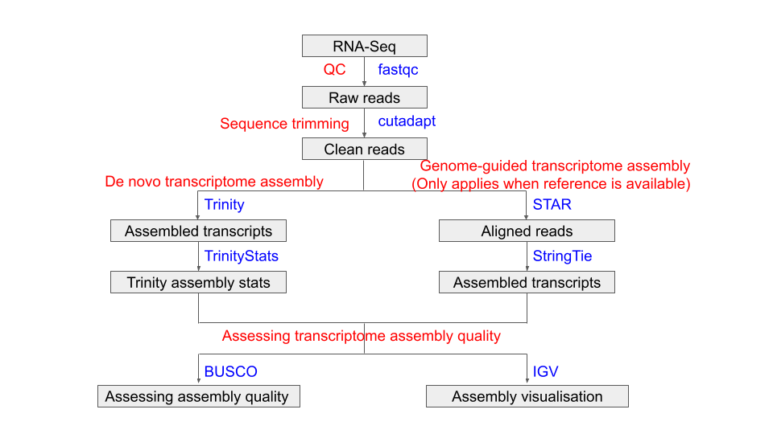

# Week 12 Transcriptomics Practical - assembly
*By Zhipeng Qu* 

{:.no_toc}

* TOC
{:toc}

## Introduction

In this practical, we will use a RNA-Seq dataset from a model plant *Arabidopsis thaliana* (Wang et al, 2017, <https://onlinelibrary.wiley.com/doi/10.1111/tpj.13481>). This dataset was initially used for identification of long non-coding RNAs by transcriptome assembly of RNA-Seq.

## Dataset

Due to the the limitation of computing resources in our VM, we will use a subset of raw reads (reads from chromomose 2 of Arabidopsis) from one of three biological replicates sampled from leaf tissue. Here are some informations for Arabidopsis and this RNA-Seq datatset:

- Reference genome build: TAIR10 (<https://www.arabidopsis.org/index.jsp>)
- Number of chromosomes: 5 chromosomes + Chloroplast + Mitochondria
- Genome size: ~135 Mb

- Number of raw reads (pairs): 747,412
- Sequencing type: PE125

## Tools and pipeline

The pipeline of today's Prac is shown in the following flowchart:



Tools used in this Prac:

| Tool/Package| Version     | URL |
| ----------- | ----------- | ----------- |
| fastQC      | v0.11.9     |   <https://www.bioinformatics.babraham.ac.uk/projects/fastqc/>   |
| cutadapt    | 3.5         |   <https://cutadapt.readthedocs.io/en/stable/>   |
| Trinity     | 2.15.1      |   <https://github.com/trinityrnaseq/trinityrnaseq/wiki>   |
| GMAP        | 2021-12-17  |   <http://research-pub.gene.com/gmap/>   |
| STAR        | 2.7.10a     |   <https://github.com/alexdobin/STAR>   |
| StringTie   | v2.2.1      |   <https://ccb.jhu.edu/software/stringtie/>   |
| BUSCO       | 5.4.4       |   <https://busco.ezlab.org/>   |
| gffread     | 0.12.7      |   <http://cole-trapnell-lab.github.io/cufflinks/> |
| IGV         | web         |   <https://software.broadinstitute.org/software/igv/> |

## Running time estimate (based on teaching VM)

The following table shows the estimated run time in VM for the major steps:

| Step        | Tool/Package| Estimated run time |
| ----------- | ----------- | ----------- |
| QC                            | fastQC      | 3 mins  |
| Sequence trimming             | cutadapt    | 4 mins  |
| De novo assembly              | Trinity     | 2.5 hrs |
| Genome mapping for transcripts| GMAP        | 3 mins  |
| Genome mapping for short reads| STAR        | 10 mins |
| Genome-guided assembly        | StringTie   | 1 mins  |
| BUSCO for Trinity             | BUSCO       | 3 mins  |
| BUSCO for StringTie           | BUSCO       | 3 mins  |
| Viewing assembly in IGV       | IGV         | N/A     |

## What you will learn in this Practical

- Practice bash commands you have learned
- Practice QC for NGS data you have learned
- Learn how to do genome-guided transcriptome assembly
- Learn how to do de novo transcriptome assembly

# Practicals for transcriptome assembly

There are three parts to the transcriptome assembly in this Prac. Please follow the instructions __in order__, because some commands will rely on the results from previous commands. Feel free to talk to tutors/instructors if you have a problem/question.

## Part 1, Setup and data preparation

In this part, we will create some folders to keep files (including input RNA-Seq raw reads, databases and output files) organised.

### 1.1 Prepare folder structure for the project

For each project, I normally store files at different processing stages in different folders. I put initial input data into a `data` folder, and output files from different processing stages into separate folders in a `results` folder. If there are databases involved, I also create a `DB` folder. I store all scripts in a separate `scripts` folder (we won't use this folder in this Prac).

```bash
mkdir prac_transcriptomics_assembly
cd prac_transcriptomics_assembly
mkdir 01_bin 02_DB 03_raw_data 04_results
cd 04_results
mkdir 01_QC 02_clean_data 03_genome_guided_assembly 04_denovo_assembly 05_final_assembly
```

The final folder structure for this project will look like this:

```
prac_transcriptomics_assembly/
├── 01_bin
├── 02_DB
├── 03_raw_data
└── 04_results
    ├── 01_QC
    ├── 02_clean_data
    ├── 03_genome_guided_assembly
    ├── 04_denovo_assembly
    └── 05_final_assembly
```

### 1.2 Raw data and DB

The initial RNA-Seq raw data is stored in the shared data directory `~/data/prac_assembly_week12`.

Copy the raw data to your `data` folder

```bash
cp ~/data/prac_assembly_week12/*.fastq.gz ~/prac_transcriptomics_assembly/03_raw_data/

```

The databases, including Arabidopsis reference genome (TAIR10_chrALL.fa), annotated genes (TAIR10_GFF3_genes.gtf), and BUSCO lineages file (viridiplantae_odb10.2020-09-10.tar.gz) need to be copied to `~/data/prac_assembly_week12` and the tarball decompressed and untarred..

```bash
cp ~/data/prac_assembly_week12/TAIR10_* ~/prac_transcriptomics_assembly/02_DB/
cp ~/data/prac_assembly_week12/viridiplantae_odb10.2020-09-10.tar.gz ~/prac_transcriptomics_assembly/02_DB/
cd ~/prac_transcriptomics_assembly/02_DB
tar -zxvf viridiplantae_odb10.2020-09-10.tar.gz
```

Now, all the setup work is done. Let's move to part 2.

## Part 2, QC

In This part, we will use the skills that we learned from the `NGS_practicals` to do QC and trim adaptors and low-quality sequences from our RNA-Seq raw data.

### 2.1 QC for raw reads

The first step is to do QC for the raw reads using fastQC

```bash
cd ~/prac_transcriptomics_assembly/04_results/01_QC
fastqc -t 2 -o ./ ~/prac_transcriptomics_assembly/03_raw_data/*.fastq.gz
```

Then we can check the QC report of the raw reads.

### 2.2 Adaptor and low-quality sequence trimming

After we finish the QC for raw reads, we need to trim adaptor and low-quality sequences from the raw reads. The adapters for this RNA-Seq dataset are Illumina TrueSeq adapters as `AGATCGGAAGAGCACACGTCTGAACTCCAGTCA` and `AGATCGGAAGAGCGTCGTGTAGGGAAAGAGTGT`.

```bash
cd ~/prac_transcriptomics_assembly/04_results/02_clean_data
cutadapt -a AGATCGGAAGAGCACACGTCTGAACTCCAGTCA -A AGATCGGAAGAGCGTCGTGTAGGGAAAGAGTGT -o Col_leaf_chr2_R1.clean.fastq.gz -p Col_leaf_chr2_R2.clean.fastq.gz --minimum-length 25 --quality-cutoff 20 ~/prac_transcriptomics_assembly/03_raw_data/Col_leaf_chr2_R1.fastq.gz ~/prac_transcriptomics_assembly/03_raw_data/Col_leaf_chr2_R2.fastq.gz
```

Then we can do QC to check the clean reads.

### 2.3 QC for clean reads

```bash
cd ~/prac_transcriptomics_assembly/04_results/02_clean_data
fastqc -t 2 -o ./ *.clean.fastq.gz
```

We can check the QC reports for the clean reads and compare them with the raw reads.

## Part 3, Genome guided transcriptome assembly (Only applicable if there is a reference genome)

In this section, we will do genome guided transcriptome assembly using STAR and StringTie.

### 3.1 Genome mapping using STAR

The first step for genome guided transcriptome assembly is to map RNA-Seq reads to a reference genome. We will use STAR to do this job in this practical (You can also choose other short RNA aligners to do the mapping).

For genome mapping using STAR, we first need to build the genome index.

```bash
cd ~/prac_transcriptomics_assembly/02_DB
STAR --runThreadN 2 --runMode genomeGenerate --genomeDir ~/prac_transcriptomics_assembly/02_DB/TAIR10_STAR125 --genomeFastaFiles TAIR10_chrALL.fa --sjdbGTFfile TAIR10_GFF3_genes.gtf --sjdbOverhang 124 --genomeSAindexNbases 12
```

And then, we map the clean reads to the reference genome. The command line for this is a little complicated, it is broken down below so that you can see what it is doing.

```bash
cd ~/prac_transcriptomics_assembly/04_results/03_genome_guided_assembly
STAR --genomeDir ~/prac_transcriptomics_assembly/02_DB/TAIR10_STAR125 --readFilesIn ~/prac_transcriptomics_assembly/04_results/02_clean_data/Col_leaf_chr2_R1.clean.fastq.gz \
~/prac_transcriptomics_assembly/04_results/02_clean_data/Col_leaf_chr2_R2.clean.fastq.gz --readFilesCommand zcat \
--runThreadN 2 --outSAMstrandField intronMotif --outSAMattributes All \
--outFilterMismatchNoverLmax 0.03 --alignIntronMax 10000 --outSAMtype BAM SortedByCoordinate \
--outFileNamePrefix Col_leaf_chr2. --quantMode GeneCounts
```

You can copy and paste this version.

```bash
cd ~/prac_transcriptomics_assembly/04_results/03_genome_guided_assembly
STAR --genomeDir ~/prac_transcriptomics_assembly/02_DB/TAIR10_STAR125 --readFilesIn ~/prac_transcriptomics_assembly/04_results/02_clean_data/Col_leaf_chr2_R1.clean.fastq.gz ~/prac_transcriptomics_assembly/04_results/02_clean_data/Col_leaf_chr2_R2.clean.fastq.gz --readFilesCommand zcat --runThreadN 2 --outSAMstrandField intronMotif --outSAMattributes All --outFilterMismatchNoverLmax 0.03 --alignIntronMax 10000 --outSAMtype BAM SortedByCoordinate --outFileNamePrefix Col_leaf_chr2. --quantMode GeneCounts
```

STAR will output multiple files with prefix `Col_leaf_chr2`. To get an idea about the mapping info, you can check `Col_leaf_chr2.final.Log.out`. The mapped reads are stored in a `bam` file called `Col_leaf_chr2.Aligned.sortedByCoord.out.bam`. To view this file in IGV, we need to create an index file.

```bash
cd ~/prac_transcriptomics_assembly/04_results/03_genome_guided_assembly
samtools index Col_leaf_chr2.Aligned.sortedByCoord.out.bam
```

In next step, we will use this mapped bam file to do genome guided transcriptome assembly.

### 3.2 Assembly using StringTie

The command for genome guided transcriptome assembly is as follows:

```bash
cd ~/prac_transcriptomics_assembly/04_results/03_genome_guided_assembly
stringtie Col_leaf_chr2.Aligned.sortedByCoord.out.bam -o StringTie.gtf -p 2
```

StringTie only outputs coordinates for assembled transcripts in into the assembled transcripts file. We can get the sequences of the assembled transcripts using a command called `gffread`.

```bash
cd ~/prac_transcriptomics_assembly/04_results/03_genome_guided_assembly
gffread -w StringTie.fasta -g ~/prac_transcriptomics_assembly/02_DB/TAIR10_chrALL.fa StringTie.gtf
```

### 3.3 Assessing the assembly quality using BUSCO

After we get the assembled transcripts, we need to find some ways to assess the quality of the assembly, such as the completeness of genes/transcripts. One way that we can check the assembly quality is by using BUSCO (Benchmarking Universal Single-Copy Orthologs, <https://busco.ezlab.org/>). BUSCO provides quantitative measures for the assessment of genome assembly, gene set, and transcriptome completeness, based on evolutionary-informed expectation of gene content from near-universal single-copy orthologs selected from different lineages.

BUSCO was installed under a different conda environment in VM, before run BUSCO, we need to activate the conda environment:

```bash
source activate busco
```

You should be able to see that your terminal prompt is now showing `(busco) axxxxxxx@ip-xx-xxx-x-xx:/shared/axxxxxxx$` after the `busco` environment is activated.

```bash
cd ~/prac_transcriptomics_assembly/04_results/03_genome_guided_assembly
busco -i StringTie.fasta -l ~/prac_transcriptomics_assembly/02_DB/viridiplantae_odb10 -o BUSCO_StringTie_viridiplantae -m transcriptome --cpu 2
```

BUSCO will output a bunch of files including the information for predicted ORFs (Open Reading Frames) from assembled transcripts and output files from a `blast` search against orthologs. Of these output files, the most important one is the text file called `short_summary_BUSCO_StringTie_viridiplantae.txt`. In  it you will find one summary line that looks like this `C:21.7%[S:15.1%,D:6.6%],F:5.4%,M:72.9%,n:425`. This line summarises the completeness of assembled transcripts, and explanations of these numbers can be found in the same text file after the one line summary.

```
        --------------------------------------------------
        |Results from dataset viridiplantae_odb10         |
        --------------------------------------------------
        |C:21.7%[S:15.1%,D:6.6%],F:5.4%,M:72.9%,n:425     |
        |92     Complete BUSCOs (C)                       |
        |64     Complete and single-copy BUSCOs (S)       |
        |28     Complete and duplicated BUSCOs (D)        |
        |23     Fragmented BUSCOs (F)                     |
        |310    Missing BUSCOs (M)                        |
        |425    Total BUSCO groups searched               |
        --------------------------------------------------
```

## Part 4, De novo transcriptome assembly

In Part 2, we had trimmed the adapter and low-quality sequences from the reads. Next we will do _de novo_ transcriptome assembly using Trinity.

Trinity is installed under a different conda environment named `trinityenv`, so we need to activate the environment before we run trinity:

```bash
source activate trinityenv
```

### 4.1 De novo assembly using Trinity

We will use the clean reads as input.

```bash
cd ~/prac_transcriptomics_assembly/04_results/04_denovo_assembly
Trinity --seqType fq --left ~/prac_transcriptomics_assembly/04_results/02_clean_data/Col_leaf_chr2_R1.clean.fastq.gz \
--right ~/prac_transcriptomics_assembly/04_results/02_clean_data/Col_leaf_chr2_R2.clean.fastq.gz \
--output Col_leaf_chr2_trinity --CPU 2 --max_memory 8G --bypass_java_version_check
```

This step will take more than 2 hours, so we will finish here today and let the VM finish the job, and we will come back to run the remaining analyses in next session.

### 4.2 Get Trinity assembly statistics

All results from Trinity will be stored in the folder of `Col_leaf_chr2_trinity` in the directory `~/prac_transcriptomics_assembly/04_results/04_denovo_assembly`. It includes a lot of intermediate files and log files created during the Trinity assembly process. The final output file includes all final assembled transcripts and is named `Trinity.fasta`.  

The Trinity package provides a useful utility to summarise the basic assembly statistics.

```bash
cd ~/prac_transcriptomics_assembly/04_results/04_denovo_assembly
/usr/local/bin/util/TrinityStats.pl ./Col_leaf_chr2_trinity.Trinity.fasta
```

And you will get output like this:

```
################################
## Counts of transcripts, etc.
################################
Total trinity 'genes':  4736
Total trinity transcripts:      6000
Percent GC: 42.21

########################################
Stats based on ALL transcript contigs:
########################################

        Contig N10: 3254
        Contig N20: 2516
        Contig N30: 2071
        Contig N40: 1751
        Contig N50: 1501

        Median contig length: 766
        Average contig: 1021.80
        Total assembled bases: 6130806


#####################################################
## Stats based on ONLY LONGEST ISOFORM per 'GENE':
#####################################################

        Contig N10: 3165
        Contig N20: 2447
        Contig N30: 2011
        Contig N40: 1686
        Contig N50: 1427

        Median contig length: 635.5
        Average contig: 930.81
        Total assembled bases: 4408303

```

This report gives us some basic statistics of the assembled transcripts from Trinity, such as the number of genes and transcripts and length of transcripts.

__Questions: What is the difference between transcripts and genes? Why have we got more transcripts than genes?__

### 4.3 Assessing the assembly quality using BUSCO

As we did before, we can use BUSCO to assess the assembly quality.

And remember to activate `busco` environment before you run busco.

```bash
cd ~/prac_transcriptomics_assembly/04_results/04_denovo_assembly
busco -i ./Col_leaf_chr2_trinity.Trinity.fasta -l ~/prac_transcriptomics_assembly/02_DB/viridiplantae_odb10 -o BUSCO_Trinity_viridiplantae -m transcriptome --cpu 2
```

__Questions:__

- What is the short summary of the BUSCO report for the Trinity assembly?
- How many complete orthologs did it find?
- How many duplicated and single copy orthologs did it find?
- Which assembly is better, the genome guided assembly or the `Trinity` assembly?


### 4.4 Align assembled transcripts to the genome (Only applicable if there is a reference genome)

_Arabidopsis_ has a reference genome, therefore we can map the assembled transcripts to the reference genome to get a genomic coordinates file (GTF or GFF format). We will use an aligner called `GMAP` (<http://research-pub.gene.com/gmap/>) to do the genome mapping.

To use `GMAP`, we first need to build the genome index.

```bash
cd ~/prac_transcriptomics_assembly/02_DB
gmap_build -D ./ -d TAIR10_GMAP TAIR10_chrALL.fa
```

After building the genome index, we can map the assembled transcripts to the reference genome using following commands:

```bash
cd ~/prac_transcriptomics_assembly/04_results/04_denovo_assembly
gmap -D ~/prac_transcriptomics_assembly/02_DB/TAIR10_GMAP -d TAIR10_GMAP -t 2 -f 3 -n 1 ./Col_leaf_chr2_trinity.Trinity.fasta > Trinity.gff3
```

This will generate a GFF3 format file, including genomic coordinates for our _de novo_ assembled transcripts, which we can import into IGV for visualisation.

## Part 5, Visualising your assembled transcripts in IGV

After we finish the _de novo_ transcriptome assembly and genome guided transcriptome assembly, we can visualise our results in IGV to check the assembly quality and look for interesting genes/transcripts.

First, we will put all the important final files into one folder.

```bash
cd ~/prac_transcriptomics_assembly/04_results/05_final_assembly
cp ~/prac_transcriptomics_assembly/04_results/03_genome_guided_assembly/StringTie.fasta ./
cp ~/prac_transcriptomics_assembly/04_results/03_genome_guided_assembly/StringTie.gtf ./
cp ~/prac_transcriptomics_assembly/04_results/03_genome_guided_assembly/Col_leaf_chr2.Aligned.sortedByCoord.out.bam ./
cp ~/prac_transcriptomics_assembly/04_results/03_genome_guided_assembly/Col_leaf_chr2.Aligned.sortedByCoord.out.bam.bai ./
cp ~/prac_transcriptomics_assembly/04_results/04_denovo_assembly/Col_leaf_chr2_trinity.Trinity.fasta ./
cp ~/prac_transcriptomics_assembly/04_results/04_denovo_assembly/Trinity.gff3 ./
```

Then we can check the assembled transcripts by loading the `Trinity.gff3` and `StringTie.gtf` into IGV. We can also load the `bam` file into IGV to check the reads supporting assembled transcripts.

We will use online version of IGV in this Prac, and you can accsse the online IGV using this [link](https://igv.org/app/). 
