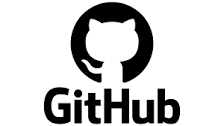

## Quiz

Please load the Version Control Quiz in "my uni"

At 11:15 I will release the password. The timers are done individually, please be quiet if you finish the test to allow others to concentrate


## GitHub

Git is the command line tool (and file based version control database). As we have seen in previous pracs, you can do it entirely on your local computer.



GitHub is website that runs Git on the cloud to help you host a repository. There are others similar sites like GitLab and BitBucket.

A centrally hosted repo on the internet (with authorization) is useful as you can access it from many computers

They also provide many other features to help you run software projects like issue trackers, wikis and more.

## Bioinformatics projects / repositories

Here are some repositories of famous bioinformatics tools.

Go and view the pages, skim the README and the issue trackers. Open some random issues

[IGV](https://github.com/igvteam/igv) - paper in 2013, last commit 2 days ago (from Oct 5 2023)

[Samtools](https://github.com/samtools/samtools) - paper in 2009, last commit 2 weeks ago

[BWA](https://github.com/lh3/bwa) - paper in 2009, last commit September 23, 2022. New development is being done on [BWA-MEM2](https://github.com/bwa-mem2/bwa-mem2)

Compare the release date of the paper vs the last commit.

Consider how different it must be from the first release, and whether the authors realised someone (or they themselves) would be working on the code 13 years later!

**Note:** Notice how the commit frequency and issue tracker is a good way to evaluate a project's health.

## Issues - searching

Go to [IGV issues](https://github.com/igvteam/igv/issues)

Notice how all you can see are the titles. Titles are extremely important.

Before raising a bug, you should always check it see if it has already been reported (ie don't create a "dupe")

Run a few searches. Experiment with clicking on Open/Closed. Notice how special tokens in the search form change. 

Again, notice how the title is critical for finding things as you can't see the contents (though you can search for it, eg "font" will bring up titles without "font" in it, as they have it in the issue)

GitHub handles [user authentication](https://docs.github.com/en/get-started/learning-about-github/access-permissions-on-github)

You can make organisations (which are basically groups that own projects rather than individual users).

This is a matter of choice (or lab policy) but I generally release work projects under my organisation as it's more professional, makes it easier for my coworkers to maintain it, and our lab seems more permanent than an individual job. You can always transfer it, and have the old URL redirect, but generally it's better to make URLs permanent.

## Sign up to GitHub


## New GitHub project

On https://github.com - create a new project:

* In the top right hand corner, click the plus symbol, then “new repository”
* Call it eg 'github_practical_example_project'
* Choose a licence (any will do), add a README.
* Make it public (you can always make it private later, or delete it) - you need it to be public to be able to use the wiki

## Clone your repo

* Go to your project on GitHub
* Press the green "Code" button in the mid-top-right - this should open a "clone" window
* Copy / paste the URL, it should be something like "https://github.com/YOUR_USERNAME_HERE/github_practical_example_project"
* Clone it to your VM:

```
git clone https://github.com/YOUR_USERNAME_HERE/github_practical_example_project
```

* If your repo is private, you will need to enter your username/password here. The password is the access token (not GitHub password)
* Make a change to the README.md

```
cd github_practical_example_project  # go into the repository you just cloned
git add README.md
git commit --message "edit README"
git push
```

If the repo is public (and you didn't have to enter it when you cloned it - as anyone can do that) you will have to enter your username / password (access token)

CTR+C out of this now.

## Access tokens

GitHub uses [Personal access tokens](https://docs.github.com/en/authentication/keeping-your-account-and-data-secure/creating-a-personal-access-token) rather than passwords. To generate one of these for the VM:

* Click on your user icon in the top right
* Click "Settings"
* In bottom left menu option - "Developer Settings", then "Personal Access token"
* Generate new token (classic), label it something like "bioinformatics VM". Make sure you click the first tickbox "repo" so you can use it to push/pull

**DO NOT CLOSE THIS TAB** - leave it open so you can copy/paste it below

You can store your token (as plaintext on the VM) via:

```
git config --global credential.helper store
```

If you do this you will only have to enter your token once. If someone gets this token they can make changes to your GitHub repo so please password protect your VMs

## Completing git push with access tokens

```
git push
# It will now ask for your username - this is what you used to sign up, and can be seen in the URL of the repo you cloned after "github.com/<YOUR_USERNAME>/your_repo"
# Paste username then hit enter
# Copy the Personal access token from the web page (green, click "two squares" copy button)
# Paste access token then hit enter
```

Push should complete successfully

If you did close the tab, just create another token now, and use that.

## Issues - labels

As well as titles, labels can be used to organise issues into related themes. Read the documentation [Github - managing labels](https://docs.github.com/en/issues/using-labels-and-milestones-to-track-work/managing-labels)

* Create some labels for your project, with distinct colours - if you're unimaginative you could use "red", "green", "blue" with appropriate colours
* Raise some fake issues on your project, don't worry about content just make a lot of different titles (ie "problem X with red", "problem Y with red", "problem X with green", "problem Y with green")
* Tag the issues with appropriate keywords (view each individual issue, click label cog on right hand toolbar, select from autocomplete)
* Perform a search for keywords, and notice how the labels make it easier to find related 
* Try clicking on a label (this does a search by label)

## Issues - lifecycle

Issues move througha  lifecycle, ie:

raised -> fixed -> tested -> closed
raised -> tagged as "duplicate", "wontfix" -> comment about which other issue is a duplicate + close

* Find an issue, 
* Add "wontfix" label
* Add a comment at the bottom saying this issue is too hard / out of scope of the project and close the issue
* Go back to the search, notice it's gone

## Issues - writing tips

Even for your own projects - try and write it with as much information as possible (aiming to be standalone, so you don't need much outside context), so that a 3rd party can come in and make sense of things.

If it's clear - maybe it'll stop them raising a dupe. Maybe someone will fix it for you!

Depending on the type of bug, there's certain information you want to include

For crashes: stack traces and logs

For ones that involve complicated user steps - Try to find a way to “reproduce” the error consistently and produce clear step by step instructions. Ideally your instructions should reproduce the issue 100% of the time with a minimal amount of steps

For ones involving input files, perhaps try and produce a minimal, cut down one.

For unexpected behavior, or outputs, [Actual vs Expected](https://medium.com/we-are-testers/chapter-2-how-to-write-useful-actual-and-expected-results-details-in-your-bug-report-10b83e5aaa75) is very useful

## Milestones

Milestones are a way of managing releases and deadlines

For instance, you may have 20 issues, but your lab head says you have to stop coding and start writing up your paper in 2 weeks.

* Create a milestone called "Code complete for paper" with a deadline in 2 weeks time
* Assign a few issues to this (you will need to go into each individual issue, click milestone cog, select from autocomplete)
* Go back to issues, search by milestone

## Wiki

Note: Free GitHub accounts can only have wikis on public projects

Check to see if you have a "wiki" menu item on your project. If you don't you can either skip this step or make your project public.

* Go to settings
* Scroll all the way down into the "danger zone"
* In "Change repository visibility" set project to public
* In settings again, you should now have an option to enable wikis

To experiment with wikis:

* Create a few wiki pages for your practical project (the one you made not forked)
* Use 2 levels of headers "#" and "##"
* Go to the wiki page, notice that it has built a hierarchical wiki browser for you out of your headers
* Try out the search and expanding the wiki in the right side of the screen

## Extras

* Try editing the README on GitHub as well as locally. Think about repos (GitHub's repo or yours) being a few commits ahead or behind. Try editing different lines then push/pulling. Try editing the same line then push/pulling
* Tags are a label for a commit, and are useful for things like "tagging a release". It's easier than memorising a date or a hash. Try making some tags for your repository. Google for help on GitHub tags to find out the steps
* Read some closed issues on some famous bioinformatics GitHub projects, eg: [IGV](https://github.com/igvteam/igv), [Samtools](https://github.com/samtools/samtools), [BWA](https://github.com/lh3/bwa) Notice how they often involve conversations over long periods of time.

[GitHub extra reading](https://university-of-adelaide-bx-masters.github.io/BIOTECH-7005-BIOINF-3000/Practicals/github_advanced/github_extra.html)


